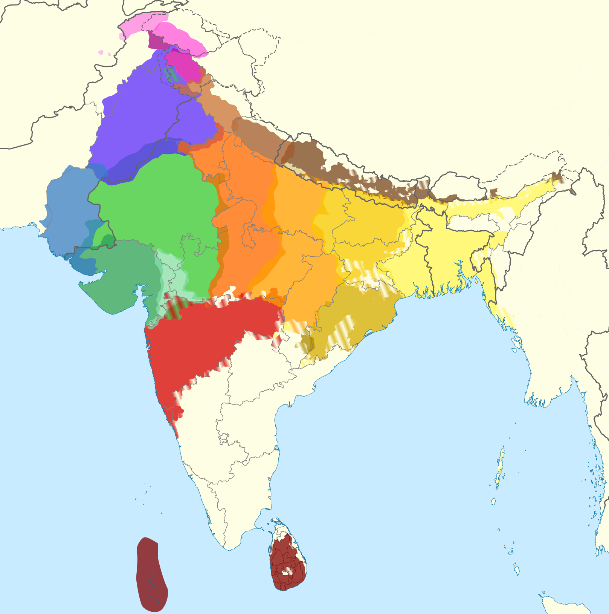

# Classics Converter

An online tool using Latin and Sanskrit to predict words in their modern descendant languages.
Rather than translating between languages, this tool relies on phonological changes
that linguists have pieced together in order to predict a word in one language
from another. Hosted at [harysdalvi.com/classics-converter](https://www.harysdalvi.com/classics-converter).

For example, the Latin word *oculum* evolved into Spanish *ojo*. This tool
can predict that and more.

But it's not perfect: it doesn't capture phonological changes, and a lot of language evolution can't be described fully by these simple rules. Please feel free to contribute to help make this a really useful tool for studying historical phonology!

## Overview
User input is converted into an internal representation of the word in Latin or Sanskrit, which may differ slightly from the user input. The goal of this program is to map the internal representation in one language to a representation in another, and then map that to a human-readable orthography in the language.

This is done by applying a series of rules. For example, Sanskrit consonant clusters like *sr* and *kt* are often simplified in descendant languages according to a set list of rules.

* `orthography.js` contains functions for mapping between internal representations and orthographies, as well as some more things that other files depend on.
* `word.js` contains utilities for conversions, especially the `Word` class and its subclasses. This makes string manipulations in this context a lot more convenient than raw JavaScript.
* `convert.js` has the bulk of the conversions.
* `es.py` is an old file, serving as a demo of conversions from Latin to Spanish and Italian.

